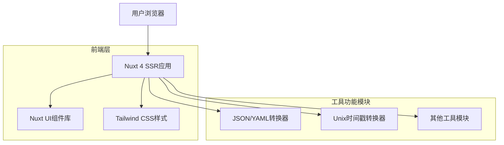

## 1. 架构设计



## 2. 技术描述

- **前端框架**: Nuxt 4 (Vue 3) + TypeScript
- **UI组件库**: Nuxt UI
- **样式框架**: Tailwind CSS
- **初始化工具**: nuxi-init
- **后端**: 无 (纯前端应用)

## 3. 路由定义

| 路由 | 用途 |
|-------|---------|
| / | 导航首页，展示所有工具 |
| /tools/json-yaml | JSON/YAML互相转换工具 |
| /tools/unix-timestamp | Unix时间戳转换工具 |

## 4. 页面组件结构

### 4.1 布局组件
```typescript
// layouts/default.vue
interface LayoutProps {
  title: string
  description: string
}
```

### 4.2 工具页面组件
```typescript
// pages/tools/json-yaml.vue
interface JsonYamlConverter {
  input: string
  output: string
  conversionType: 'json-to-yaml' | 'yaml-to-json'
  formatOutput: boolean
}

// pages/tools/unix-timestamp.vue
interface UnixTimestampConverter {
  timestamp: number
  dateString: string
  format: string
  currentTimezone: string
}
```

## 5. 工具功能实现

### 5.1 JSON/YAML转换器
```typescript
interface ConversionResult {
  success: boolean
  output: string
  error?: string
}

class JsonYamlService {
  jsonToYaml(jsonString: string): ConversionResult
  yamlToJson(yamlString: string): ConversionResult
  validateJson(jsonString: string): boolean
  validateYaml(yamlString: string): boolean
}
```

### 5.2 Unix时间戳转换器
```typescript
interface TimestampConversion {
  timestamp: number
  date: Date
  formattedDate: string
  timezone: string
}

class UnixTimestampService {
  timestampToDate(timestamp: number, format: string): TimestampConversion
  dateToTimestamp(date: Date): number
  getCurrentTimestamp(): number
  getSupportedFormats(): string[]
}
```

## 6. 状态管理

使用Nuxt 3的composables进行状态管理：

```typescript
// composables/useTools.ts
interface Tool {
  id: string
  name: string
  description: string
  icon: string
  route: string
  category: string
}

export const useTools = () => {
  const tools = ref<Tool[]>([])
  const selectedTool = ref<Tool | null>(null)
  
  const getToolsByCategory = (category: string) => {
    return tools.value.filter(tool => tool.category === category)
  }
  
  return {
    tools: readonly(tools),
    selectedTool: readonly(selectedTool),
    getToolsByCategory
  }
}
```

## 7. 性能优化配置

### 7.1 Nuxt配置
```typescript
// nuxt.config.ts
export default defineNuxtConfig({
  ssr: true,
  nitro: {
    compressPublicAssets: true,
  },
  experimental: {
    payloadExtraction: false
  },
  vite: {
    build: {
      rollupOptions: {
        output: {
          manualChunks: {
            'json-yaml': ['yaml', 'json-formatter'],
            'date-utils': ['date-fns']
          }
        }
      }
    }
  }
})
```

### 7.2 Tailwind配置
```typescript
// tailwind.config.ts
export default {
  content: [
    './components/**/*.{js,vue,ts}',
    './layouts/**/*.vue',
    './pages/**/*.vue',
    './plugins/**/*.{js,ts}',
    './nuxt.config.{js,ts}'
  ],
  theme: {
    extend: {
      colors: {
        primary: {
          50: '#eff6ff',
          500: '#3b82f6',
          900: '#1e3a8a'
        },
        tech: {
          cyan: '#06b6d4',
          purple: '#8b5cf6'
        }
      },
      animation: {
        'pulse-slow': 'pulse 3s cubic-bezier(0.4, 0, 0.6, 1) infinite',
        'glow': 'glow 2s ease-in-out infinite alternate'
      }
    }
  }
}
```

## 8. 部署配置

### 8.1 构建配置
```json
// package.json
{
  "scripts": {
    "build": "nuxt build",
    "generate": "nuxt generate",
    "preview": "nuxt preview",
    "postinstall": "nuxt prepare"
  }
}
```

### 8.2 环境变量
```bash
# .env
NUXT_PUBLIC_SITE_NAME=工具库
NUXT_PUBLIC_SITE_URL=https://tools.example.com
NUXT_PUBLIC_DESCRIPTION=实用的在线工具集合
```