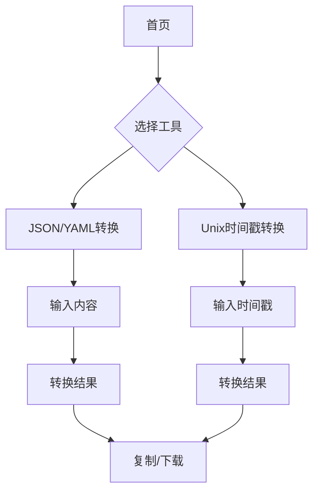

## 1. 产品概述

这是一个现代化的工具库网站，提供各种实用的小工具服务。网站采用科技风格设计，注重用户体验和加载速度。

主要解决开发者和普通用户的日常工具需求，提供简洁高效的在线工具服务。目标用户包括开发者、技术人员以及需要在线工具的普通用户。

## 2. 核心功能

### 2.1 用户角色

| 角色 | 注册方式 | 核心权限 |
|------|----------|----------|
| 访客用户 | 无需注册 | 可使用所有工具功能 |

### 2.2 功能模块

工具库网站包含以下主要页面：
1. **导航首页**：科技风格导航、工具分类展示、快速访问
2. **JSON/YAML转换工具**：JSON转YAML、YAML转JSON、格式化验证
3. **Unix时间戳转换工具**：Unix时间戳转日期格式、日期转Unix时间戳、当前时间戳

### 2.3 页面详情

| 页面名称 | 模块名称 | 功能描述 |
|-----------|-------------|---------------------|
| 导航首页 | 顶部导航栏 | 显示网站Logo、工具分类导航 |
| 导航首页 | 英雄区域 | 科技风格背景动画、网站标题简介 |
| 导航首页 | 工具卡片网格 | 展示所有工具的图标、名称、简介 |
| 导航首页 | 底部信息 | 版权信息、联系方式 |
| JSON/YAML转换 | 输入区域 | 支持粘贴或上传JSON/YAML文件 |
| JSON/YAML转换 | 转换控制 | 选择转换方向、格式化选项 |
| JSON/YAML转换 | 输出区域 | 显示转换结果、支持复制下载 |
| JSON/YAML转换 | 错误提示 | 格式验证失败时显示错误信息 |
| Unix时间戳转换 | 时间戳输入 | 输入Unix时间戳或选择当前时间 |
| Unix时间戳转换 | 日期格式选择 | 选择输出日期格式 |
| Unix时间戳转换 | 转换结果 | 显示转换后的日期时间 |
| Unix时间戳转换 | 反向转换 | 支持日期时间转Unix时间戳 |

## 3. 核心流程

用户访问网站的主要流程：

访客用户流程：
1. 访问首页 → 浏览工具分类 → 选择所需工具 → 使用工具功能 → 获得结果

工具使用流程：
1. JSON/YAML转换：选择工具 → 输入内容 → 选择转换类型 → 点击转换 → 查看/复制结果
2. Unix时间戳转换：选择工具 → 输入时间戳或日期 → 选择格式 → 自动转换 → 查看结果

## 4. 用户界面设计

### 4.1 设计风格

- **主色调**：深蓝色渐变 (#1e3a8a 到 #3b82f6)
- **辅助色**：青色 (#06b6d4)、紫色 (#8b5cf6)
- **背景色**：深色模式 (#0f172a) 配合霓虹光效
- **按钮样式**：圆角矩形，悬停发光效果
- **字体**：Inter 或 Roboto，标题加粗，正文字体大小 14-16px
- **布局风格**：卡片式网格布局，顶部导航栏固定
- **图标风格**：线性图标，配合渐变色彩

### 4.2 页面设计概览

| 页面名称 | 模块名称 | UI元素 |
|-----------|-------------|-------------|
| 导航首页 | 顶部导航 | 深色背景，Logo使用发光字体，导航项悬停变色 |
| 导航首页 | 英雄区域 | 动态粒子背景，渐变文字标题，呼吸灯效果 |
| 导航首页 | 工具卡片 | 毛玻璃效果卡片，悬停放大，图标使用渐变色彩 |
| JSON/YAML转换 | 输入区域 | 代码编辑器样式，语法高亮，行号显示 |
| JSON/YAML转换 | 控制面板 | 按钮组切换转换方向，开关控制格式化 |
| Unix时间戳转换 | 输入框 | 大字体输入框，实时转换反馈 |

### 4.3 响应式设计

采用桌面端优先设计，确保在PC端有最佳的视觉体验。移动端自适应，主要调整：
- 导航栏在小屏幕下变为汉堡菜单
- 工具卡片从多列变为单列布局
- 输入区域高度自适应屏幕大小
- 按钮大小适配触摸操作

### 4.4 性能优化

- SSR服务端渲染确保首屏加载速度
- 代码分割和懒加载减少初始包体积
- 静态资源CDN加速
- 工具功能按需加载，减少不必要的资源消耗